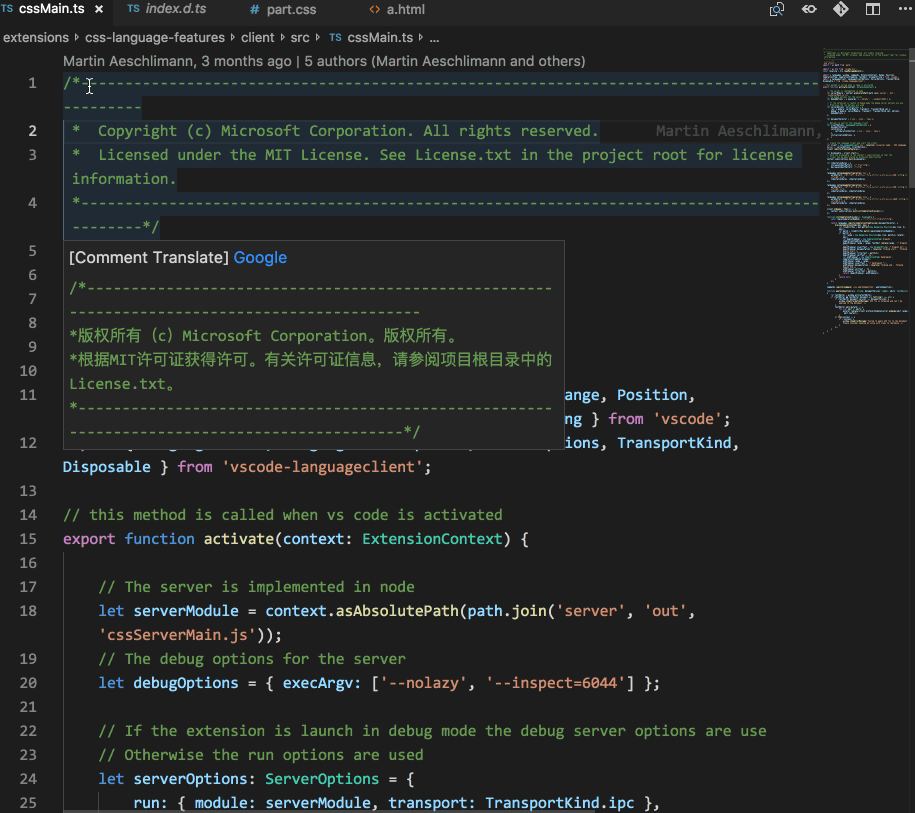
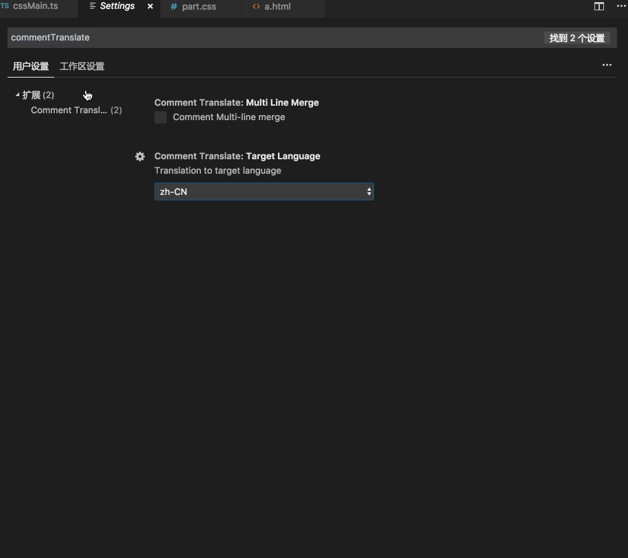
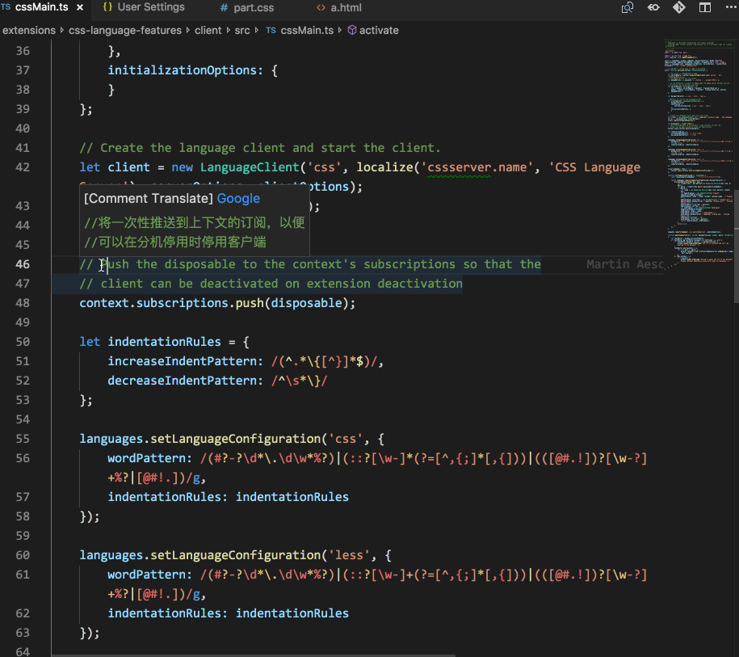

# VSCode Comment Translate

## Introduction
[【中文文档】](./doc/README_ZH-CN.md) [【日本語の文書】](./doc/README_JA.md)

Many excellent projects have a lot of annotations, and users can quickly understand the code intent. However, if the user is not familiar with the annotated language, it will bring difficulties in understanding. This plugin uses the Google Translate API to translate comments for the VSCode programming language.

## Features
Identify the comment portion of the code without interfering with reading. Support for different languages, single-line, multi-line comments.


## Settings Options
#### Multi-language support

Display Language | Locale
-----------------|-------
English (US) | `en`
Simplified Chinese | `zh-CN`
Traditional Chinese | `zh-TW`
French | `fr`
German | `de`
Italian | `it`
Spanish | `es`
Japanese | `ja`
Korean | `ko`
Russian | `ru`
Bulgarian | `bg`
Hungarian | `hu`
Portuguese (Brazil) | `pt-br`
Turkish | `tr`

#### Merge multiple lines of comments (source language only supports English)
