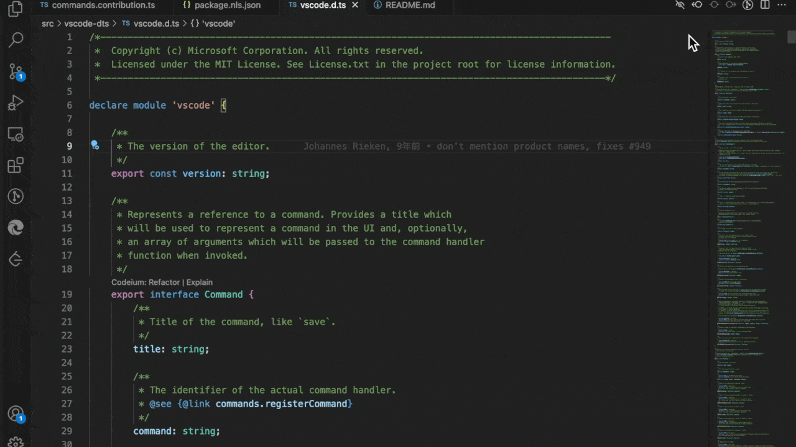

# VSCode 注释翻译

## 简介

[【English】](./doc/README.md) [【日本語の文書】](./doc/README_JA.md)

许多优秀的项目，都有丰富的注释，使用者可以快速理解代码意图。但是如果使用者并不熟习注释的语言，会带来理解困难。
本插件使用 Google、Bing、Baidu、AliCloud、DeepL等的 Translate API 翻译 VSCode 的编程语言的注释。

## 功能
1. Hover识别并翻译代码中注释部分。支持不同语言，单行、多行注释。
2. Hover翻译选中区域文本（划词翻译）
3. 翻译并快速替换选中文本
4. 翻译并替换文件中所有"字符串"或"注释"
   * 如果有选中的文本区域，只识别并翻译替换选中区域的“字符串”或“注释”
5. 翻译Hover内容。（实验功能）

## 配置
* `commentTranslate.hover.enabled`: 开启/关闭悬停翻译（可以通过状态快速设置）
* `commentTranslate.hover.concise`: 开启/关闭简洁模式.开启后只有按住ctrl或command才会触发悬浮翻译
* `commentTranslate.hover.string`: 开启/关闭字符串悬停翻译
* `commentTranslate.hover.content`: 开启/关闭翻译悬停内容
* `commentTranslate.multilineMerge`: 合并多行注释
* `commentTranslate.targetLanguage`: 翻译目标语言，没有设置的情况下使用vscode本地语言。（可以通过状态快速设置）
* `commentTranslate.source`: 翻译服务源配置。建议通过命令完成设置。 支持插件扩展翻译服务源。 [example](https://github.com/intellism/deepl-translate)

## 翻译源
* 支持外部“翻译源”扩展。目前外部插件已支持 [ChatGPT](https://marketplace.visualstudio.com/items?itemName=kitiho.chatgpt-comment-translate) & [DeepL](https://marketplace.visualstudio.com/items?itemName=intellsmi.deepl-translate) & [tencent cloud](https://marketplace.visualstudio.com/items?itemName=Kaiqun.tencent-cloud-translate) 翻译源. 
* 已内置Ali翻译源。 可以通过 [开通阿里云机器翻译](https://www.aliyun.com/product/ai/alimt) 生成 accessKeyId & accessKeySecret ,并配置到插件中。切换对应翻译源，获得更稳定的翻译服务
