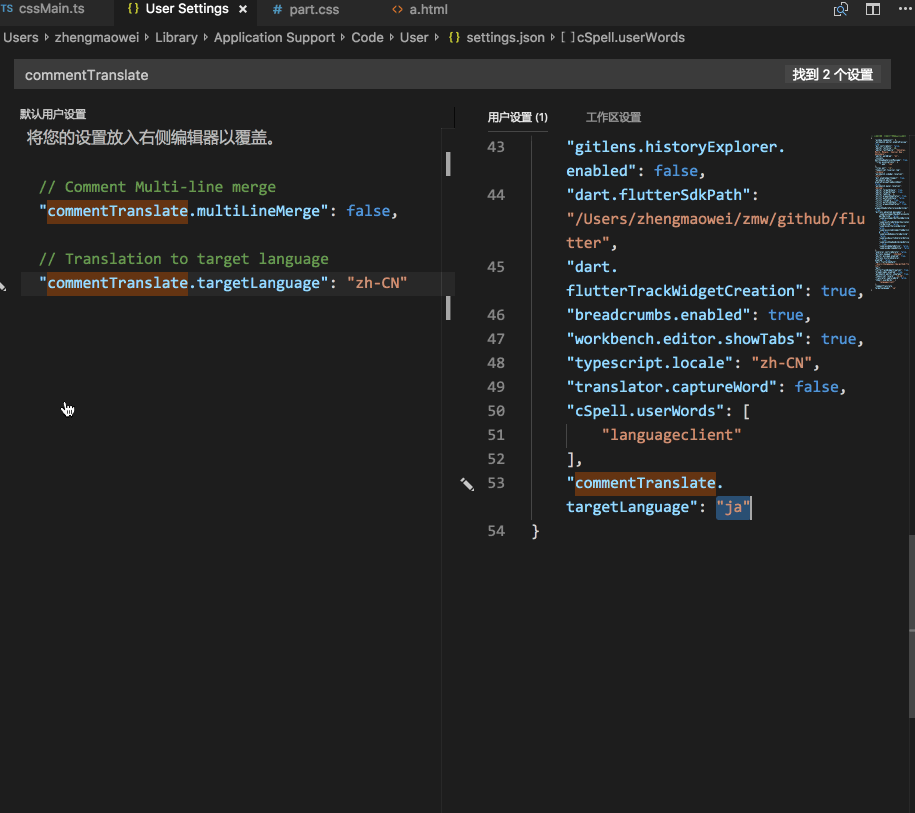
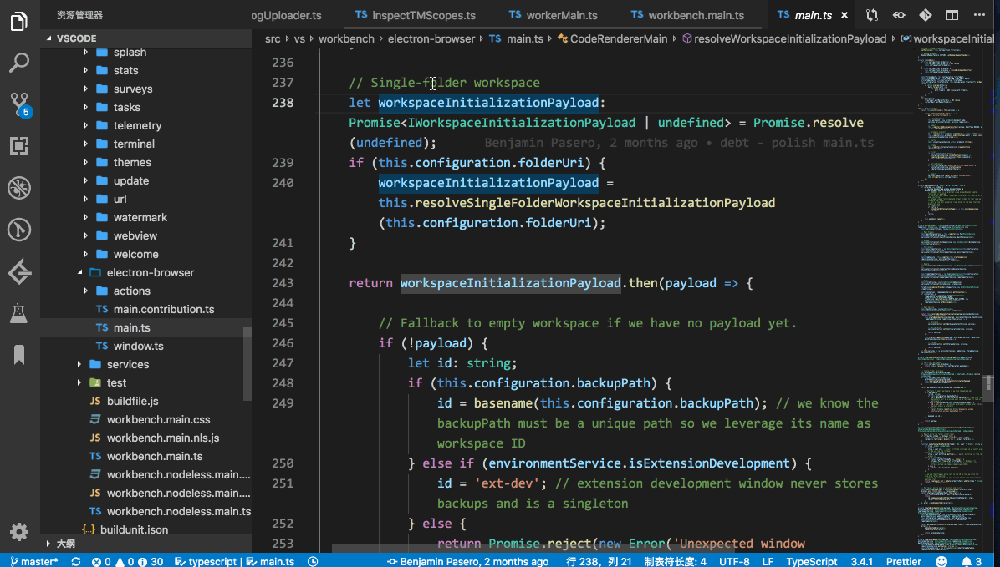
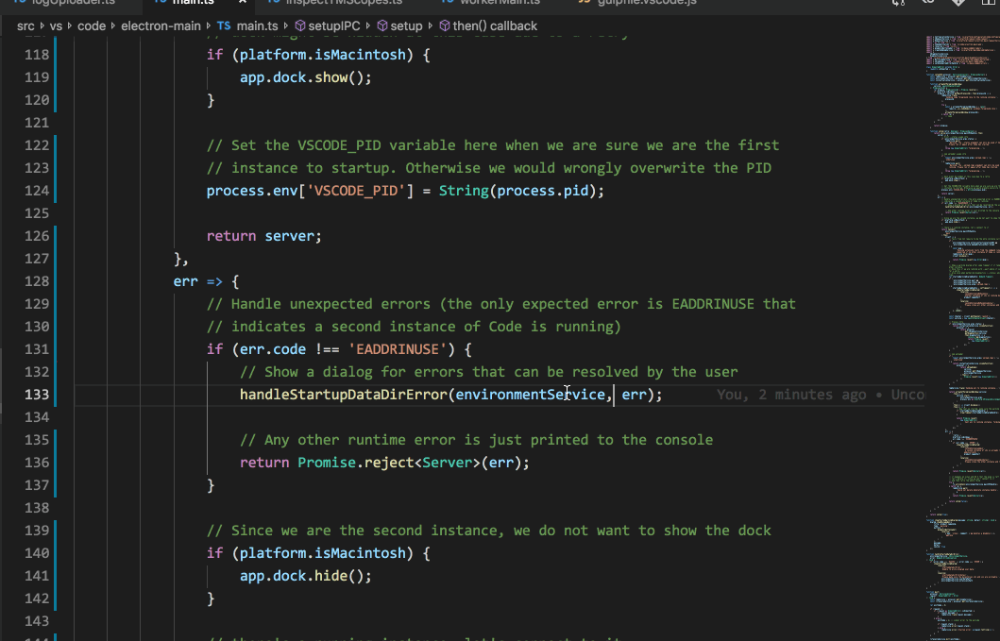
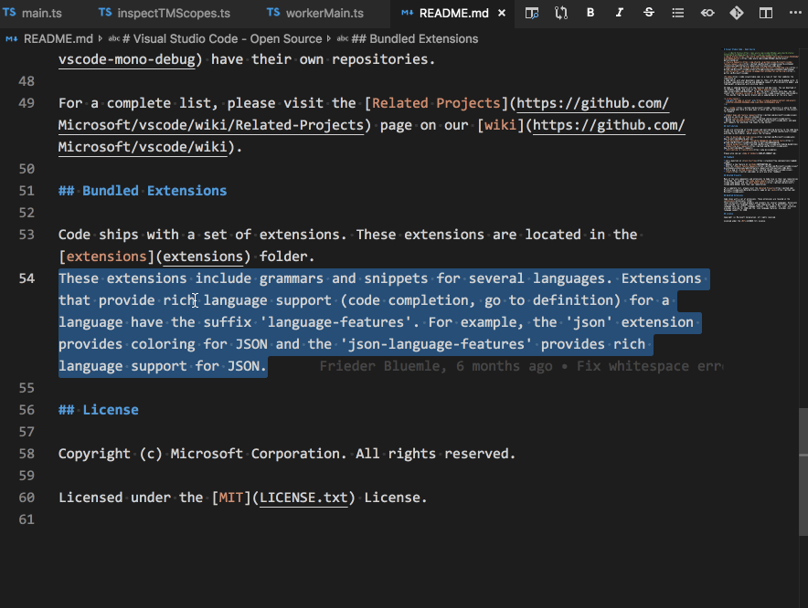
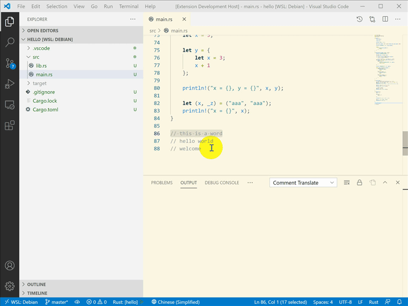
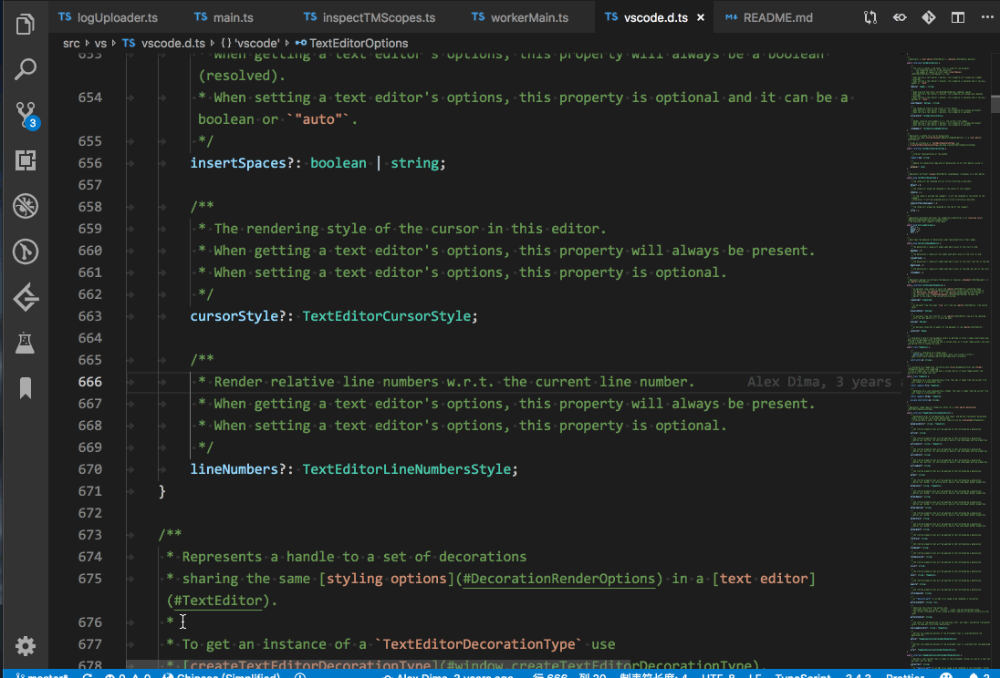

# VSCode 注釈翻訳

## 前書き
[【English】](./README.md) [【中文文档】](../README.md)

多くの優れたプロジェクトには多くのアノテーションがあり、ユーザーはコードの意図をすばやく理解することができます。 しかし、ユーザが注釈付き言語に精通していないと、理解が困難になります。 このプラグインは、Google Translate APIを使用してVSCodeプログラミング言語のコメントを翻訳します。

## 特徴
1. 読むことを妨げることなくコードのコメント部分を特定する。 さまざまな言語、1行、複数行のコメントをサポートします

2. ハンプ分割をサポートするためのユーザー文字列と変数変換のサポート

3. 最後の翻訳エリアを選択

4. 選択の翻訳と置換

5. 選択範囲翻訳

6. 選択したテキストを翻訳する (WSL 環境でも使用できます)

## 設定オプション
#### 多言語サポート
ターゲット言語をすばやく設定するためのステータスバー

| Display Language    | Locale  |
| ------------------- | ------- |
| English (US)        | `en`    |
| Simplified Chinese  | `zh-CN` |
| Traditional Chinese | `zh-TW` |
| French              | `fr`    |
| German              | `de`    |
| Italian             | `it`    |
| Spanish             | `es`    |
| Japanese            | `ja`    |
| Korean              | `ko`    |
| Russian             | `ru`    |
| Bulgarian           | `bg`    |
| Hungarian           | `hu`    |
| Portuguese (Brazil) | `pt-br` |
| Turkish             | `tr`    |

#### 複数行のコメントをマージする（ソース言語は英語のみサポート）

