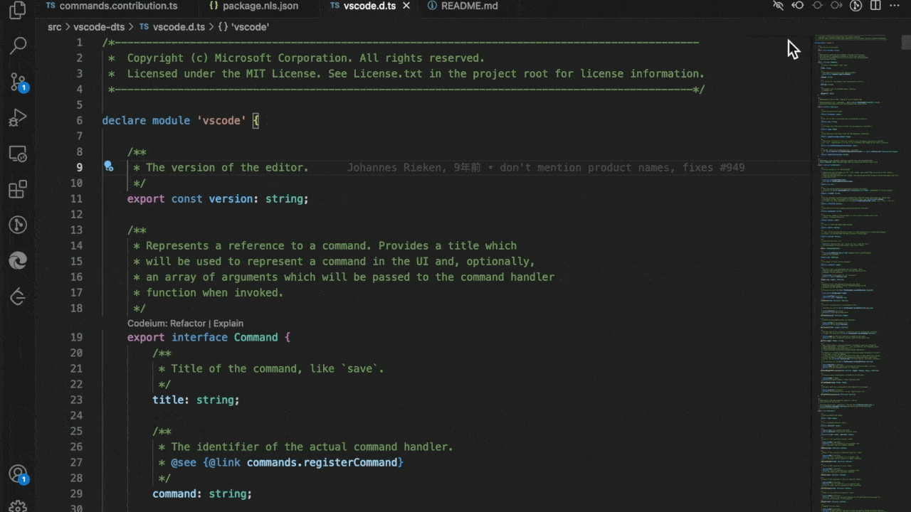
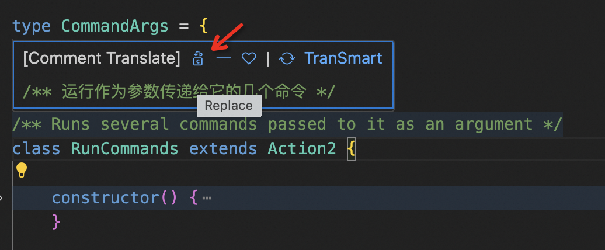
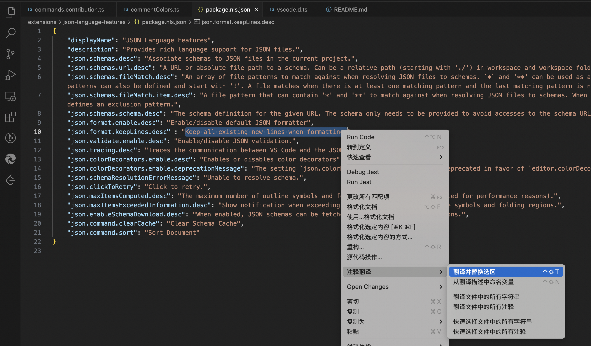
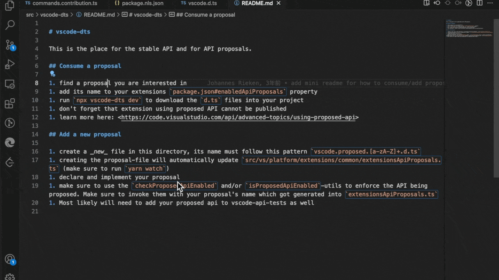

# VSCode 주석 번역 플러그인

이 플러그인은 개발자가 코드의 주석, 문자열, 코드 힌트, 오류 알림 및 변수 이름 등의 내용을 번역하는 데 도움을 줍니다.

## 소개
[【English】](../README.md) [【日本語の文書】](./README_JA.md) [【한국어】](./README_KR.md)

많은 훌륭한 프로젝트에는 사용자가 코드의 의도를 빠르게 이해할 수 있도록 돕는 풍부한 주석이 있습니다. 사용자가 주석의 언어에 익숙하지 않으면 이해하기 어려울 수 있습니다. 이 플러그인은 다양한 번역 시나리오를 제공하여 개발자가 다국어 코드를 더 쉽게 이해하고 작성할 수 있도록 돕습니다. 플러그인은 Google, Bing, AliCloud, DeepL 등 일반적인 번역 서비스를 지원하며, 개발자가 번역 서비스를 사용자 정의하여 추가할 수 있습니다.

## 기능

### 코드 읽기
플러그인은 TextMate를 통해 소스 코드의 주석, 문자열 등의 다국어 내용을 인식하고 빠르게 번역하여 Hover로 표시하여 개발에 대한 방해를 최소화합니다.

**Hover 번역**: 주석, 문자열 또는 선택 영역 위로 마우스를 이동하면 번역된 내용이 Hover로 표시됩니다. 예외, 코드 문서와 같은 다른 Hover 내용도 번역되어 표시됩니다.

**몰입형 읽기**: 몰입형 주석 번역을 열면 주석이 자동으로 번역되어 문서에 표시됩니다. 번역 결과를 원문과 대조하여 표시하거나 자리 표시로 표시하는 것을 지원하며, 설정 또는 단축키 `Ctrl+Shift+B`를 통해 표시 방식을 전환할 수 있습니다.

### 번역 및 교체
플러그인은 소스 코드의 내용을 번역할 뿐만 아니라 번역된 내용을 문서에 빠르게 교체할 수 있습니다. 예를 들어, 설명을 번역하여 변수 이름으로 사용하거나 다국어 개발 시나리오에서 문자열을 번역하여 문서에 교체할 수 있습니다.

**변수 이름 번역**: 현재 설명을 영어로 번역한 후 다양한 변수 이름을 제공하며, 선택하면 원래 설명을 교체합니다.

**Hover 교체**: Hover 번역 상자에서 교체 기능을 제공하며, 선택하면 번역 결과가 원문 내용을 교체합니다.

**전체 교체 번역**: 문자열, 주석, 선택 영역을 지원하며, 한 번의 클릭으로 전체를 번역된 텍스트로 교체합니다.

### GitHub Copilot Chat 참가자: @translate
  > - GitHub Copilot Chat 플러그인을 미리 설치하고 권한을 가져야 합니다.
  > - GitHub Copilot 사용자에 대해 현재 Chat 상자 내에서 번역을 지원하며, 주석, 텍스트 등의 내용은 이 기능을 사용하여 번역할 수 없습니다.

이 플러그인은 GitHub Copilot을 확장하여 Chat 상자에서 `@translate`를 통해 번역할 수 있으며, Copilot이 제공하는 AI 대모델을 사용하여 텍스트를 번역합니다. 번역 대상 언어는 CommentTranslate 설정의 대상 언어입니다. Editor에서 텍스트를 선택한 후 명령을 통해 GitHub Copilot Chat으로 빠르게 전송하여 번역할 수 있습니다.

## 유용한 명령

> Mac: `ctrl+shift+?` / Windows: `alt+shift+?`

플러그인은 다양한 시나리오의 번역 또는 교체 명령을 제공하며, 일부 자주 사용하는 기능에는 단축키가 미리 설정되어 있습니다. 사용자는 자신의 습관에 따라 단축키를 사용자 정의할 수 있습니다.
- **몰입형 주석 번역**: 현재 문서의 몰입형 번역 읽기 켜기/끄기 `ctrl+shift+z`
- **몰입형 표시 방식**: 대조/자리 표시 읽기 방식 전환 `ctrl+shift+b`
- **변수 이름 번역**: 현재 설명 단어를 번역하여 변수 이름 제공 `ctrl+shift+n`
- **번역 교체**: 선택한 내용을 번역하여 현재 위치에 교체 `ctrl+shift+t`
- **Copilot 빠른 번역**: 선택한 내용 또는 클립보드를 GitHub Copilot Chat에서 번역 `ctrl+shift+y`

## 번역 서비스

이 플러그인은 다음 번역 서비스를 지원합니다:
- **Google 번역**: 내장, 무료 버전. 기본 사용
  - **참고**: 네트워크 요구 사항이 있으며, 일부 사용자는 프록시가 필요합니다. 네트워크 문제가 발생하면 Bing 사용을 권장합니다.
- **Bing 번역**: 내장, 무료 버전.
- **AliCloud 번역**: 내장, accessKeyId & accessKeySecret 설정 필요
  
타사 번역 서비스는 플러그인 마켓에서 `@tag:translateSource`를 검색하여 찾을 수 있습니다. 사용자는 플러그인 설정을 통해 사용할 번역 서비스를 선택하거나 번역 서비스를 사용자 정의하여 확장할 수 있습니다. [더 많은 링크](https://github.com/intellism/vscode-comment-translate/wiki/Translation-Service)

## 자주 사용하는 설정
* `commentTranslate.hover.enabled`: Hover 번역 켜기/끄기 (상태를 통해 빠르게 설정 가능)
* `commentTranslate.hover.concise`: 간결 모드 켜기/끄기. 켜면 ctrl 또는 command를 눌러야 Hover 번역이 트리거됩니다.
* `commentTranslate.hover.string`: 문자열 Hover 번역 켜기/끄기
* `commentTranslate.hover.content`: 번역 Hover 내용 켜기/끄기
* `commentTranslate.multilineMerge`: 여러 줄 주석 병합
* `commentTranslate.targetLanguage`: 번역 대상 언어, 설정이 없으면 vscode 로컬 언어를 사용합니다. (상태를 통해 빠르게 설정 가능)
* `commentTranslate.source`: 번역 서비스 소스 설정. 명령을 통해 설정 완료를 권장합니다. 플러그인 확장 번역 서비스 소스를 지원합니다. [예시](https://github.com/intellism/deepl-translate)
* `commentTranslate.maxTranslationLength`: 최대 번역 길이 설정. 너무 긴 문자 번역으로 인한 과도한 요금 문제를 피하기 위해 설정합니다.
* `commentTranslate.browse.enabled`: 프로젝트 몰입형 브라우징 번역 기능 켜기/끄기

## 지원하기

이 플러그인이 도움이 되었다면 다음 방법으로 지원해 주세요:
- GitHub에서 Star 주기 [intellism/vscode-comment-translate](https://github.com/intellism/vscode-comment-translate)
- 피드백 및 제안 제출
- 친구 및 동료에게 공유
